<!-- coderprint:start -->

<a href="https://github.com/WikdSolvemProbler/coderprint"><picture><source media="(prefers-color-scheme: dark)" srcset="assets/panel-dark.svg"><source media="(prefers-color-scheme: light)" srcset="assets/panel-light.svg"></picture></a><a href="https://github.com/kittinan/spotify-github-profile"><picture><source media="(prefers-color-scheme: dark)" srcset="https://spotify-github-profile.kittinanx.com/api/view?uid=1joahg6umn39flaqsl1c3j9n3&cover_image=true&theme=default&show_offline=false&background_color=100f0e&interchange=false&profanity=false&hide_remaster=false"><source media="(prefers-color-scheme: light)" srcset="https://spotify-github-profile.kittinanx.com/api/view?uid=1joahg6umn39flaqsl1c3j9n3&cover_image=true&theme=default&show_offline=false&background_color=281e16&interchange=false&profanity=false&hide_remaster=false"></picture></a>

<!-- coderprint:end -->
