<!-- coderprint:start -->
<!-- Machine-readable: the card's figures, what each means and how it was counted, schema coderprint/1, at assets/coderprint.json (https://raw.githubusercontent.com/WikdSolvemProbler/WikdSolvemProbler/HEAD/assets/coderprint.json) -->
<a href="https://github.com/WikdSolvemProbler/coderprint#gh-dark-mode-only"><picture><source media="(prefers-color-scheme: light)" srcset="https://raw.githubusercontent.com/WikdSolvemProbler/WikdSolvemProbler/HEAD/assets/blank.svg"><source media="(max-width: 540px)" srcset="https://coderprint-relay.vercel.app/api/card?user=WikdSolvemProbler&mode=dark&layout=compact"></picture></a><a href="https://github.com/WikdSolvemProbler/coderprint#gh-light-mode-only"><picture><source media="(prefers-color-scheme: dark)" srcset="https://raw.githubusercontent.com/WikdSolvemProbler/WikdSolvemProbler/HEAD/assets/blank.svg"><source media="(max-width: 540px)" srcset="https://coderprint-relay.vercel.app/api/card?user=WikdSolvemProbler&mode=light&layout=compact"></picture></a>
<!-- coderprint:end -->

<!-- coderprint:organizations:start -->
Organization contributions · manually refreshed 2026-09-29

<!-- Machine-readable organization card: assets/organizations/coderprint.json -->
<a href="https://github.com/WikdSolvemProbler/coderprint#gh-dark-mode-only"><picture><source media="(prefers-color-scheme: light)" srcset="assets/organizations/blank.svg"><source media="(max-width: 540px)" srcset="assets/organizations/panel-compact-dark.svg"></picture></a><a href="https://github.com/WikdSolvemProbler/coderprint#gh-light-mode-only"><picture><source media="(prefers-color-scheme: dark)" srcset="assets/organizations/blank.svg"><source media="(max-width: 540px)" srcset="assets/organizations/panel-compact-light.svg"></picture></a>
<!-- coderprint:organizations:end -->
